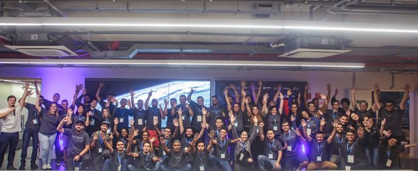
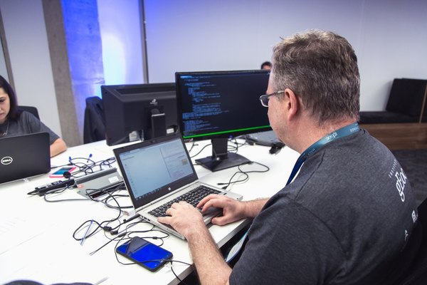
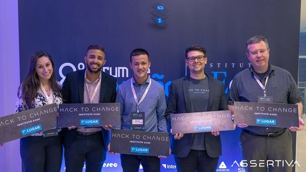
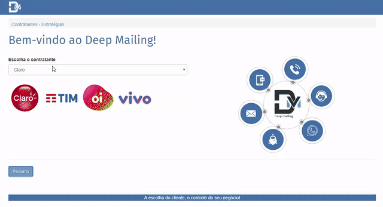

## [IGEOC Hackathon](https://www.facebook.com/instituto.geoc/media_set?set=a.1676933069072587.1073741854.100002677316162&type=3&notif_id=1526571589339666&notif_t=feedback_reaction_generic) - Deep Mailing Project (1st Place)

During the 5th to the 7th of May of 2018, the IGEOC Institute Sponsored a Hackathon to allow the public to propose new tools and methodologies for the Debt-Collection Business in Brazil.

[IGEOC](http://www.igeoc.org.br/ "Instituto IGEOC") is the Association of Debt-Collection Companies in brazil and is responsible to represent and help regulate this business in conjunction with the Brazilian Government



During 36 continuous hours, 12 groups worked to propose the best solution, which included: ChatBots, Natural Language Processing, Self-Service Apps for automatic negotiation of Debts and many others.



Our solution was based on the integration of Debt-Collection processes using a [BPMN](https://en.wikipedia.org/wiki/Business_Process_Model_and_Notation) like tool that integrates the reception of debt data from the financial institutions, its validation, priorization and then processing
through the several contact tools that we use today to reach out for the debtor.

## First Place

The Judges and Audience understood that today there is a lacking on integration tools for this business and chose our tool as the best of the 12 presented.



## Deep Mailing

With the motto that the main concern in reaching out the customer is not the contact medium (*like Email, SMS, ChatBot, WebPage*) and so on, but the lack of planning tools for the correct planning of such contact, we proposed
a tool to integrate the several platforms that we currently use to execute such contact. [BPMN](https://en.wikipedia.org/wiki/Business_Process_Model_and_Notation) is the best standard for heterogenous applications to exchange data and execute complex processes.



## Usage

The Current Demo is simply a Static Web Site where the user can create a [BPMN](https://en.wikipedia.org/wiki/Business_Process_Model_and_Notation) process using a Javascript Component that allows the drag and drop of connections and processes.

In order to use it, copy the contents of the **application** folder into a web server serving folder and open the website on your browser.

It can be server locally using python:
```
python3 -m http.server
```
or nodejs:
```
npm install -g http-server
http-server
```

## Architecture

The Web site uses a simple bootstrap interface for the CRUD of the strategy and then the user can design the process using [BPMNJS](https://github.com/bpmn-io/bpmn-js). Such library was customized in order to allow for the creation of 
Debt-Collection specific components.
